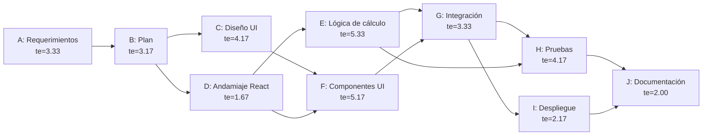

# Plan de Proyecto — Calculadora Web Básica

**Materia:** Fundamentos de Ingeniería de Software
**Modelo de ciclo de vida:** Cascada
**Fecha de inicio:** jueves 27 de agosto de 2026
**Fecha límite de entrega:** jueves 3 de septiembre de 2026

---

## 1. Descripción general

Desarrollo de una calculadora web básica que ejecuta las cuatro operaciones aritméticas
elementales (suma, resta, multiplicación y división), con manejo interno de errores para
que la aplicación no falle ante casos como la división entre cero. No requiere backend,
historial persistente ni funciones científicas (ver `../analisis-requerimientos/requerimientos.md`).

## 2. Stack técnico

| Capa | Herramienta | Justificación |
|---|---|---|
| Lenguaje | JavaScript (ES2022) | Definido por el cliente. |
| Librería UI | React 18 | Definido por el cliente; componentes reutilizables para el teclado y la pantalla. |
| Estilos | CSS plano con variables (`:root`) | Suficiente para el alcance; sin dependencia de frameworks. La paleta sale del prototipo. |
| Build tool | Vite 5 (plantilla `react`) | Arranque rápido, HMR, build optimizado, configuración mínima. |
| Pruebas | Vitest + React Testing Library | Integración nativa con Vite; API compatible con Jest. Propuesta adicional validada (ver nota del cliente en requerimientos). |
| Control de versiones | Git + GitHub (`OPT-KOR/Belman-sCalculator`) | Ramas por fase (`fase-1`, `fase-2`, `fase-3`) con merge a `main`. |
| Despliegue | GitHub Pages vía GitHub Actions | Sin costo, sin infraestructura propia; encaja con el repositorio. |

> **Nota sobre herramientas adicionales:** conforme a la nota del cliente en el documento de
> requerimientos, el uso de Vite, Vitest y GitHub Pages (herramientas de build, pruebas y
> despliegue, no de producto) se incorpora como propuesta del equipo. No cambian el alcance
> funcional ni introducen backend o persistencia.

## 3. Estructura de descomposición del trabajo (WBS)

1. **Fase 1 — Planificación y Análisis**
   1.1 Levantamiento y validación de requerimientos
   1.2 Plan de proyecto (stack, cronograma, costos)
2. **Fase 2 — Diseño e Implementación**
   2.1 Diseño de interfaz (prototipo de referencia, paleta, layout)
   2.2 Andamiaje del proyecto React (Vite)
   2.3 Lógica de cálculo (operaciones + manejo de errores)
   2.4 Componentes de UI (pantalla, teclado, botones)
   2.5 Integración y estilos
3. **Fase 3 — Pruebas, Despliegue y Mantenimiento**
   3.1 Pruebas unitarias (lógica y casos límite)
   3.2 Configuración de despliegue (GitHub Pages)
   3.3 Documentación y bitácora de cambios

## 4. Cronograma PERT

### 4.1 Tabla de actividades

Estimaciones en **horas**. Tiempo esperado `te = (O + 4M + P) / 6`.
Desviación estándar `σ = (P − O) / 6`. Varianza `σ² = ((P − O) / 6)²`.

| ID | Actividad | Predecesoras | O | M | P | te | σ² |
|----|-----------|--------------|---|---|---|------|------|
| A | Levantamiento y validación de requerimientos | — | 2 | 3 | 6 | 3.33 | 0.44 |
| B | Plan de proyecto (stack, cronograma, costos) | A | 2 | 3 | 5 | 3.17 | 0.25 |
| C | Diseño de interfaz / prototipo de referencia | B | 2 | 4 | 7 | 4.17 | 0.69 |
| D | Andamiaje del proyecto React (Vite) | B | 1 | 1.5 | 3 | 1.67 | 0.11 |
| E | Lógica de cálculo + manejo de errores | D | 3 | 5 | 9 | 5.33 | 1.00 |
| F | Componentes de UI (pantalla, teclado, botones) | C, D | 3 | 5 | 8 | 5.17 | 0.69 |
| G | Integración y estilos | E, F | 2 | 3 | 6 | 3.33 | 0.44 |
| H | Pruebas unitarias (lógica y casos límite) | E, G | 2 | 4 | 7 | 4.17 | 0.69 |
| I | Configuración de despliegue (GitHub Pages) | G | 1 | 2 | 4 | 2.17 | 0.25 |
| J | Documentación y bitácora de cambios | H, I | 1 | 2 | 3 | 2.00 | 0.11 |

Suma de `te` ≈ **39.6 h** (coherente con la estimación de 40 h de la propuesta de costos).

### 4.2 Red de actividades

### 4.3 Cálculo de la ruta crítica

| Camino | Actividades | Duración (Σ te) |
|---|---|---|
| 1 | A → B → C → F → G → H → J | 3.33 + 3.17 + 4.17 + 5.17 + 3.33 + 4.17 + 2.00 = **25.34 h** |
| 2 | A → B → D → E → G → H → J | 3.33 + 3.17 + 1.67 + 5.33 + 3.33 + 4.17 + 2.00 = **23.00 h** |
| 3 | A → B → D → E → H → J | 3.33 + 3.17 + 1.67 + 5.33 + 4.17 + 2.00 = 19.67 h |
| 4 | A → B → C → F → G → I → J | 3.33 + 3.17 + 4.17 + 5.17 + 3.33 + 2.17 + 2.00 = 23.34 h |

**Ruta crítica: Camino 1 — A → B → C → F → G → H → J = 25.34 h.**

- Varianza de la ruta crítica: `σ²_cp = 0.44 + 0.25 + 0.69 + 0.69 + 0.44 + 0.69 + 0.11 = 3.31`
- Desviación estándar: `σ_cp = √3.31 ≈ 1.82 h`
- Estimación de duración del proyecto: **25.34 h ± 1.82 h** de trabajo efectivo.

### 4.4 Holguras

Actividades **D** y **E** (rama de la lógica) y la actividad **I** (despliegue) tienen holgura
respecto a la ruta crítica; un retraso moderado en ellas no compromete la fecha de entrega.
La rama de diseño e integración de UI (C → F → G → H) es la que debe vigilarse.

### 4.5 Calendario propuesto (27 ago – 3 sep 2026)

| Día | Fase | Actividades |
|---|---|---|
| Jue 27 ago | Fase 1 | A, B |
| Vie 28 ago | Fase 2 | C, D |
| Sáb 29 – Dom 30 ago | Fase 2 | E, F |
| Lun 1 sep | Fase 2 | G |
| Mar 2 sep | Fase 3 | H, I |
| Mié 3 sep* | Fase 3 | J, revisión final |
| **Jue 3 sep** | **Entrega** | Cierre y despliegue en producción |

\* Buffer: el trabajo termina el miércoles para dejar el jueves como margen ante imprevistos.

## 5. Estimación de costos

Tarifas de referencia (MXN/hora) para la propuesta académica; ajustables al acuerdo real.

| Rol | Horas estimadas | Tarifa/hora | Costo total |
|---|---|---|---|
| Líder de proyecto | 8 h | $180 | $1,440 |
| Analista | 10 h | $150 | $1,500 |
| Desarrollador (React) | 16 h | $160 | $2,560 |
| QA / Tester | 6 h | $130 | $780 |
| **Total** | **40 h** | — | **$6,280 MXN** |

### Supuestos

- Las horas cubren únicamente el alcance descrito en el documento de requerimientos.
- No se contemplan costos de infraestructura, hosting ni licencias: el proyecto no requiere
  backend ni persistencia, y el despliegue en GitHub Pages es gratuito.
- Las tarifas por hora son valores de referencia del equipo, no confirmados por el cliente.
- Cualquier cambio de alcance posterior a la validación de requerimientos se gestiona mediante
  control de cambios formal y puede modificar esta estimación.

### Costos de operación posteriores a la entrega

| Concepto | Costo |
|---|---|
| Hosting (GitHub Pages) | $0 |
| Dominio | $0 (subdominio `github.io`) |
| Mantenimiento correctivo | Bajo demanda, según bitácora de cambios (Fase 3) |

## 6. Riesgos

| Riesgo | Prob. | Impacto | Mitigación |
|---|---|---|---|
| Ambigüedad en el manejo de errores (formato del mensaje) | Media | Bajo | Definir estado de error explícito en la lógica y cubrirlo con pruebas. |
| Problemas de `base path` al desplegar en GitHub Pages | Media | Medio | Configurar `base` en Vite y validar el build antes de la entrega. |
| Retraso en la rama de UI (ruta crítica) | Baja | Medio | Priorizar C → F → G; usar el prototipo como especificación cerrada. |
| Cambio de alcance de último momento | Baja | Alto | Requerimientos ya validados y firmados; control de cambios formal. |

## 7. Entregables por fase

- **Fase 1:** este plan + documento de requerimientos validado.
- **Fase 2:** prototipo de referencia + aplicación React funcional.
- **Fase 3:** suite de pruebas unitarias + despliegue configurado y documentado + bitácora de cambios.
